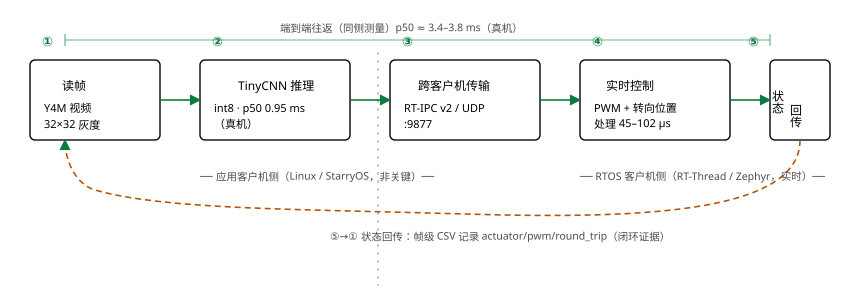
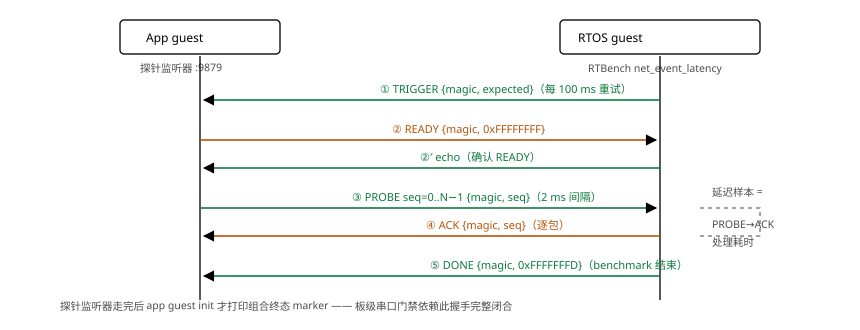

# 系统设计

> 本文档属于 [GoGoGo 成果材料](../README.md) ｜ 文档集：[设计](系统设计.md) · [更改](更改说明.md) · [性能](性能数据.md) · [验证报告](验证报告.md) · [任务对照](任务对照.md) · [提交基线](提交基线.md) · [工程实录](工程实录.md) · [复现](复现指南.md) · [协议对比](协议对比分析.md)

## 0. 系统定位

本项目是一个**基于 Type-1 hypervisor 的混合关键性（mixed-criticality）系统
验证平台**：在单块物理板上，用 hypervisor 的空间与时间隔离，让无实时保证的
通用操作系统（GPOS）与实时操作系统（RTOS）安全共存，并在二者之间跑通
感知→决策→实时控制的完整闭环。

对照混合关键性系统的定义要素，本平台的实现方式是**隔离式混合关键**
（static partitioning / AMP 路线，与 PikeOS、LynxSecure、seL4 等工业
hypervisor 同类）：

| 定义要素 | 本平台实现 |
|---|---|
| 不同关键性负载共存 | GPOS（Linux/StarryOS：AI 推理、网络客户端）+ RTOS（RT-Thread/Zephyr：实时控制）同板 |
| 空间隔离 | Stage-2 页表独立地址空间，`memory_regions` 互不可见 |
| 时间隔离 | 独占物理核 pinning + 每 VM 定时器策略（`host_timer_policy`） |
| 故障传播控制 | hypervisor 拦截所有 MMIO/IRQ；host-SPI 风暴熔断防非关键中断饿死关键侧 |
| 关键/非关键受控通信 | 仅 virtio-net + RT-IPC v2 协议，无共享内存、无裸 MMIO |

**边界说明**（如实标注，避免过度宣称）：

- 本平台**没有**显式的关键性等级标注与运行时关键性模式切换（无
  criticality 字段、无 overload 时低关键任务降级机制），不属于证书化
  混合关键（CAMA/HELTA 风格）路线。
- 时间隔离是工程隔离而非形式化保证：GIC distributor、VirtualSwitch、host
  console 仍是共享点（实测遇到并修复了 host SPI 风暴饿死 guest 时间的
  问题）。真机 RT-Thread timer jitter p99 28 µs 表明干扰被压到很小，但没有
  WCET 形式化论证。
- 本平台**未通过**任何安全认证标准（DO-178C / IEC 61508 等），定位是验证
  平台而非认证系统。

## 1. 总体架构

Axvisor（Type-1 虚拟化管理器，运行于 EL2）在一块物理板上同时承载两个客户机：

*图 1：系统架构。EL2 hypervisor 承载双客户机；绿色箭头为跨客户机数据流（AI
分类结果 :9877 与 RT-IPC 请求/响应 :9876），全部经内部 VirtualSwitch 的
virtio-net，不经过任何非网络机制。*

两个 guest 通过 hypervisor 内部的 `VirtualSwitch` 以 virtio-net 互联（标准
virtio-mmio 传输层 + IPv4/UDP），不使用共享内存、HyperCall、裸 MMIO 或 vsock。

## 2. 三个任务的闭环

| 任务 | 内容 | 数据通路 |
|---|---|---|
| Task 1 实时性 | RTOS guest 内运行 RTBench（16 项纳秒指标） | guest 本地 + 网络探针 |
| Task 2 通信 | 应用 guest 作为 RT-IPC 客户端，向 RTOS guest 的 echo 服务器发 N 次请求 | virtio-net UDP :9876 |
| Task 3 AI 控制 | 应用 guest 逐帧读取 Y4M 图像 → TinyCNN int8 推理（LEFT/CENTER/RIGHT 三分类）→ 发给 RTOS guest 更新虚拟 PWM 与转向位置 | virtio-net UDP :9877 |

Task 3 的 TinyCNN 为自研 3×3 Conv(1→4) → ReLU → 2×2 maxpool → 3×3 Conv(4→8)
→ ReLU → 空间池化 → 24→3 全连接，固定种子训练，int8 量化，C 推理与 Python
golden 逐向量等价（准确率门槛 95%，实测 100%）。

*图 2：Task 3 AI 控制闭环的五阶段数据流。①–④ 为正向流（读帧→推理→跨机
传输→实时控制），⑤为状态回传（橙色虚线环），帧级 CSV 记录每一环的证据。
顶部横线标注同侧测量的端到端往返。*

## 3. 关键设计点

### 3.1 guest 静态设备映射的兼容

RT-Thread / Zephyr 的 QEMU BSP 在自己的静态页表中硬编码 virtio-mmio 窗口
`0x0a00_0000` 与 GIC SPI 16（控制器输入 48）。配置化设备框架把 virtio-net
固定放置在该传统位置（`ResourceRequest::Fixed`），并允许 GICv3 框架下的
固定输入窗口，使这些 guest 无需改动即可探测设备。

### 3.2 RT-Thread 移植补丁集

RT-Thread v5.2.2（pin 到 `ddf52e2c`）通过 `os/axvisor/patches/rtthread/`
的 12 个补丁移植：基础 AArch64 移植（0000）、lwIP RX mailbox 恢复（0002）、
virtio-net TX/RX used-ring 修复（0003/0004）、GICv3 redistributor 寄存器
（0006/0007）、绝对定时器截止（0008）、内存布局（0009）、benchmark 钩子
（0010）、ROCK 4D 板级端口（0011，GICv2 地址 + NS16550 串口 + `RT_USING_TASK123_SERVER`
门控）以及 RX DMA cache 一致性（0011）。补丁状态以 digest 记录，防脏树重放。

### 3.3 Zephyr 移植

Zephyr v4.4.2 通过 `os/axvisor/guests/zephyr-task123/`（板型 `axvisor_rock4d`
overlay + virtnet overlay）构建。guest 在 task3 会话结束后自动运行 RTBench，
并实现 RTBENCH_NET 探针握手（trigger → READY → 逐序列 ACK → DONE），使应用
guest 的探针监听器能完整走完——这是板级串口门禁能匹配到
`TASK123_*_RTBENCH_END` 的前提。

*图 3：RTBENCH 网络探针握手协议（时序）。绿色为 RTOS→App 方向、橙色为
App→RTOS 方向；虚线框标出延迟样本的测量窗口（PROBE→ACK 处理耗时）。握手
完整闭合是板级串口门禁能匹配到组合终态 marker 的前提。*

### 3.4 RT-IPC v2 通信协议

任务二/任务三的全部跨客户机消息走两层协议：传输层为 RT-IPC v2（UDP，
:9876），载荷层为任务自定义帧（Task 3 控制/状态帧，:9877 同样封装在
RT-IPC 会话中）。

**RT-IPC v2 包头（20 字节，`rt_ipc.h`）**：

| 偏移 | 长度 | 字段 | 说明 |
|---:|---:|---|---|
| 0 | 1 | `version` | 协议版本 |
| 1 | 1 | `msg_type` | 消息类型（见下） |
| 2 | 2 | `payload_len` | 载荷长度（≤ 1400 B，防 IP 分片） |
| 4 | 4 | `seq_num` | 序号（会话独占 1/4 序列空间，回绕安全） |
| 8 | 8 | `session_id` | 会话标识（重启后区分新旧会话） |
| 16 | 2 | `error_code` | 错误码（CRC 不匹配/版本错/超时等 8 种） |
| 18 | 2 | `checksum` | CRC-16（覆盖头+载荷） |

消息类型覆盖任务要求的控制指令、状态回传与错误通知：

| 值 | 类型 | 用途 |
|---:|---|---|
| 0x01 | `CTRL_CMD` | 控制指令（Task 3 分类结果在此载荷中） |
| 0x02 | `STATUS_REP` | 状态回传（PWM/转向位置） |
| 0x03 | `ERROR_NOTIFY` | 错误通知 |
| 0x04 | `ACK` | 确认（可靠性机制） |
| 0x05/0x06 | `SYN`/`SYNACK` | 会话握手 |
| 0x07/0x08 | `HEARTBEAT`/`HEARTBEAT_ACK` | 心跳 |
| 0x09 | `FIN` | 会话结束 |

**可靠性状态机**（UDP 之上自实现，机制与规则）：

| 机制 | 规则 |
|---|---|
| 确认与重传 | ACK 确认；RTO 超时重传；单包重传次数上限（Linux 客户端 5 次、RTOS 服务器 8 次） |
| 会话建立 | SYN/SYNACK 握手；建连超时 + 指数退避重连（客户端开 auto_reconnect） |
| 保活与断连 | 心跳（Linux 客户端 1 s / RTOS 服务器 500 ms）；连续无对端活动达心跳超时（10 s）判定断连 |
| 事务期限 | 单个控制事务 = RTO ×（重传上限+1）+ 余量；超时后断连重连并重发未完成指令 |
| 乱序/重复 | 超前序号入重排缓冲（64 项）等中间包；旧序号仅补 ACK；`frame_id` 再做应用层幂等（重复帧返回缓存结果） |
| 异常输入 | 版本、长度、CRC、schema、枚举或保留字段非零一律拒绝，且不改变执行器状态 |

发送窗口 64 包在途；`session_id` 防旧会话迟到包污染新会话。各端运行时
配置可在源码核对：Linux 客户端 `rtipc_client.c`（心跳 1 s/超时 10 s/重传
5 次）、RTOS 服务器 `rtipc_server.c`/Zephyr `main.c`（心跳 500 ms/超时
10 s/重传 8 次）、库默认 `rt_ipc.c::rtipc_config_default`。传输层选 UDP
的依据（与本机 TCP 基准的对比）见[协议对比分析](协议对比分析.md)。

**Task 3 载荷帧**（`task3_protocol.h`，大端序，同样含版本/保留字段）：

| 帧 | 大小 | 字段 |
|---|---:|---|
| 控制（App→RTOS） | 24 B | schema 版本、command、mode、分类（1–3）、confidence_q15、frame_id、`tx_monotonic_ns` 时间戳、保留字段（解码侧校验非零拒绝） |
| 状态（RTOS→App） | 24 B | schema 版本、状态码、applied_class、flags（含重复帧位）、frame_id、pwm、actuator_q15、processing_us、`echoed_tx_monotonic_ns` 回显时间戳 |
| 错误 | 12 B | 分类（协议/应用）、错误码、frame_id、detail |

端到端往返延迟即由 `tx_monotonic_ns` 与回显时间戳的同侧差值测得（见
[任务对照](任务对照.md) §任务三）。

### 3.5 板级串口门禁

ostool 以 U-Boot 方式启动（TFTP 下发 axvisor.bin），成功判据是串口流中同时
出现 benchmark 结束 marker 与组合 marker（`TASK123_<GUEST>_RTBENCH_END
status=PASS`，二者必须落在 2 KiB 匹配窗口内——由 app guest 的 init 在探针
完成后紧邻打印保证）。物理串口偶发把单条 benchmark 记录从字段中间截断
（mux 输出交错），每组合保留主日志 + retry 日志，解析器合并去重只收完整行。

### 3.6 vCPU 与中断隔离

- 应用客户机 SMP：每个 vCPU 独占一个物理核（`phys_cpu_sets` 单核位），避免
  CPU_ON 握手撞上 current-vCPU publication 守卫。
- RTOS 客户机单核，pin 到独立核；`guest_tlbi_policy = vm_scoped` 时按 vCPU
  亲和集收敛 TLB 失效广播。
- host-SPI 风暴熔断：板级设备（观察到调试 UART）的 handler 声称已处理却
  不清源时，GIC 线会以 exit 路径极限速率重触发、饿死 guest 虚拟时间。同一
  host SPI 在 10 ms 内分发超过 32 次即由一次性 host task 在 distributor
  掩蔽该线。

## 4. 验证矩阵

| 平台 | RTOS | 应用客户机 |
|---|---|---|
| QEMU AArch64 TCG（4 vCPU） | RT-Thread / Zephyr | Linux / StarryOS |
| ROCK 4D 真机（8 核，--smp 8） | RT-Thread / Zephyr | Linux / StarryOS |

每个组合运行 Task 2（10 请求）+ Task 3（3 帧 ×2 模式）+ Task123 门禁 +
RTBench 16 指标 × 10 样本。门禁与指标要求见
[验证报告.md](验证报告.md)。
