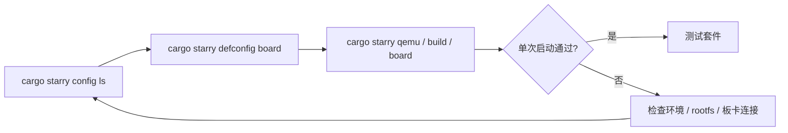

# StarryOS 快速上手

StarryOS 通过板卡配置确定目标架构、平台 feature 和运行参数。`cargo starry config ls` 列出配置名称，`cargo starry defconfig BOARD_NAME` 将选中配置写入默认构建配置和命令快照，后续 `build`、`qemu`、`uboot` 或 `board` 命令沿用该配置。



## 1. 选择板卡配置

先查看仓库当前支持的 StarryOS 板卡配置：

```bash
cargo starry config ls
```

输出中的名称可以直接传给 `defconfig`：

```bash
cargo starry defconfig qemu-riscv64
```

完成 `defconfig` 后，后续命令通常不需要再重复传 `--config`、`--target` 或 `--arch`。`quick-start` 是旧的便捷入口，后续会废弃；新的快速上手路径请使用 `config ls`、`defconfig` 和常规 `cargo starry` 子命令。

## 2. QEMU 快速启动

StarryOS 的 QEMU 启动通常包含 rootfs。当前 `qemu` 路径会在缺少 rootfs 时自动补齐，也可以显式先执行 `rootfs`。

### 2.1 RISC-V 64

`qemu-riscv64` 使用 RISC-V 64 target，并在启动时准备对应架构的 rootfs。

```bash
cargo starry defconfig qemu-riscv64
cargo starry qemu
```

或显式分步执行：

```bash
cargo starry defconfig qemu-riscv64
cargo starry rootfs --arch riscv64
cargo starry build
cargo starry qemu
```

### 2.2 AArch64

`qemu-aarch64` 使用 AArch64 target，并在启动时准备对应架构的 rootfs。

```bash
cargo starry defconfig qemu-aarch64
cargo starry qemu
```

分步执行：

```bash
cargo starry defconfig qemu-aarch64
cargo starry rootfs --arch aarch64
cargo starry build
cargo starry qemu
```

### 2.3 x86_64

`qemu-x86_64` 使用 x86_64 target 和 PC 类 QEMU 平台配置。

```bash
cargo starry defconfig qemu-x86_64
cargo starry qemu
```

分步执行：

```bash
cargo starry defconfig qemu-x86_64
cargo starry rootfs --arch x86_64
cargo starry build
cargo starry qemu
```

### 2.4 LoongArch64

`qemu-loongarch64` 使用 LoongArch64 target，运行环境需要提供 `qemu-system-loongarch64`。

```bash
cargo starry defconfig qemu-loongarch64
cargo starry qemu
```

分步执行：

```bash
cargo starry defconfig qemu-loongarch64
cargo starry rootfs --arch loongarch64
cargo starry build
cargo starry qemu
```

> `starry rootfs` 当前使用 `--arch`，不是 `--target`。  
> `starry qemu` 的 `--target` 可接受完整 target triple，也可接受简写架构名。

## 3. 开发板快速启动

开发板路径复用 `cargo starry defconfig BOARD_NAME` 选择构建配置，但 rootfs 来源、镜像传输方式和启动固件由具体硬件决定。以下三种板卡分别覆盖 LoongArch64 SATA、RISC-V SD 卡和 ostool-server 管理路径，不能互换 U-Boot 地址或根设备参数。

### 3.1 Loongson 2K1000

2K1000 使用 LoongArch64 动态平台路径，target 为 `loongarch64-unknown-none-softfloat`。U-Boot 通过 `go` 启动内核并传入 FDT，StarryOS 从板载 SATA SSD 的 ext4 分区挂载 rootfs。

#### 3.1.1 实现组件

LS2K1000 启动链路由早期引导、动态平台、中断控制器、设备发现和文件系统组件共同组成。下表把用户可见的串口、存储、网络和 rootfs 能力映射到对应 crate 与实现位置，便于按故障阶段定位代码。

| 类型 | crates | feature 或实现位置 | 作用 |
| --- | --- | --- | --- |
| 早期启动 | `someboot` | `platforms/someboot/src/arch/loongarch64/` | 解析 U-Boot 传入的 FDT，建立页表并启动 SMP |
| CPU 与动态平台 | `ax-cpu`、`axplat-dyn`、`ax-hal` | `components/axcpu/src/loongarch64/`、`platforms/axplat-dyn/` | 提供 LoongArch64 上下文、陷阱和动态平台接口 |
| 中断控制器 | `somehal`、`rdif-intc`、`irq-framework` | `platforms/somehal/src/arch/loongarch64/liointc.rs` | 探测并驱动 LS2K1000 LIOINTC |
| 驱动发现 | `rdrive`、`ax-driver` | `drivers/ax-driver/` | 根据 FDT 探测并注册板载设备 |
| 用户地址空间 | `starry-kernel` | `starry-kernel` feature `loongarch64-low-va` | 使用符合 2K1000 40-bit VA 限制的用户地址布局 |
| 串口 | `ax-driver`、`some-serial`、`rdif-serial` | `ax-driver` feature `serial`；`drivers/ax-driver/src/serial/ns16550.rs` | 驱动 NS16550，并注册运行期 `ttyS0` |
| RTC | `ax-driver` | `ax-driver` feature `rtc`；`drivers/ax-driver/src/time/loongson.rs` | 探测 `loongson,ls2k1000-rtc` |
| SATA | `ax-driver`、`dma-api`、`rdif-block` | `ax-driver` feature `ls2k1000-ahci`；`drivers/ax-driver/src/block/ahci/` | 通过 IRQ 驱动的单槽硬件队列向文件系统提供 block device |
| 网络 | `ax-driver`、`rd-net`、`ax-net` | `ax-driver` feature `ls2k1000-gmac`；`drivers/ax-driver/src/net/loongson_gmac.rs` | 驱动板载 GMAC 并注册 `eth0` |
| 根文件系统 | `ax-fs-ng`、`rsext4` | — | 扫描 SATA 分区并挂载 ext4 rootfs |

板卡配置位于 `os/StarryOS/configs/board/ls2k1000.toml`。LS2K1000 AHCI 的 FDT/MMIO、寄存器状态机、owned-DMA 队列和最小 IRQ top-half 位于 `drivers/ax-driver/src/block/ahci/`。LIOINTC 实现在 `somehal`；GMAC、RTC 和 NS16550 的 FDT 适配也位于 `ax-driver`。

#### 3.1.2 构建镜像

先选择 2K1000 配置并构建：

```bash
cargo starry defconfig ls2k1000
cargo starry build
```

也可以不修改默认配置，直接显式指定配置文件：

```bash
cargo starry build \
  --config os/StarryOS/configs/board/ls2k1000.toml
```

`ls2k1000.toml` 中的 `loongarch64-unknown-none-softfloat` 是 StarryOS 用于选择架构和平台配置的逻辑 target。实际构建时，`axbuild` 会将它映射到 `scripts/targets/std/pie/loongarch64-unknown-linux-musl.json`，因此默认 release 产物位于 `target/loongarch64-unknown-linux-musl/release/`。该目录包含 `starryos` ELF 和 `starryos.bin`，U-Boot/TFTP 使用其中的 `starryos.bin`。

实板启动前还需要准备：

- 可用的 U-Boot 网络和 TFTP 服务；
- 板载 SATA SSD 上可由 StarryOS 挂载的 ext4 rootfs；
- 串口终端，用于查看启动日志并进入 StarryOS shell。

当前配置没有写死 `root=` 参数。已验证的磁盘布局中只有一个受支持的 ext4 分区，`ax-fs-ng` 会扫描 AHCI 设备和分区表后自动选择它作为根文件系统。如果磁盘上存在多个可用文件系统分区，应显式整理根设备选择，不能依赖“唯一分区”规则。

#### 3.1.3 网络引导

先把生成的 `starryos.bin` 放到 TFTP 根目录。下面的 IP 地址是示例，应按本地网络修改：

```console
setenv ipaddr 192.168.99.20
setenv serverip 192.168.99.10
setenv netmask 255.255.255.0
```

[PR #1368](https://github.com/rcore-os/tgoskits/pull/1368) 实板验证使用下面的镜像和 FDT 地址。换用不同 U-Boot 或内存布局时，应先确认地址不会覆盖 U-Boot、FDT、内核或其它保留内存：

```console
setenv loadaddr 0x9000000098000000
setenv fdt_addr 0x900000000a000000
```

可以一次性保存下面的启动脚本：

```console
setenv starry_fdt_addr 'fdt addr ${fdtcontroladdr}'
setenv starry_fdt_size 'fdt header get fdt_size totalsize'
setenv starry_fdt_move 'fdt move ${fdtcontroladdr} ${fdt_addr} ${fdt_size}'
setenv starry_fdt_select 'fdt addr ${fdt_addr}'

setenv starry_load_tftp 'tftpboot ${loadaddr} starryos.bin'

setenv starry_hdr_entry 'setexpr hdr ${loadaddr} + 0x8'
setenv starry_read_entry 'setexpr.l kentry *0x${hdr}'
setenv starry_hdr_load 'setexpr hdr ${loadaddr} + 0x18'
setenv starry_read_load 'setexpr.l kload *0x${hdr}'
setenv starry_calc_off 'setexpr off ${kentry} - ${kload}'
setenv starry_calc_entry 'setexpr entry ${loadaddr} + ${off}'
setenv starry_print_entry 'printenv kentry kload off entry'

setenv starry_go 'go ${entry} ${fdt_addr}'
setenv boot_starry 'run starry_fdt_addr starry_fdt_size starry_fdt_move starry_fdt_select starry_load_tftp starry_hdr_entry starry_read_entry starry_hdr_load starry_read_load starry_calc_off starry_calc_entry starry_print_entry starry_go'
saveenv
```

之后每次启动执行：

```console
run boot_starry
```

仓库目前也没有 `ls2k1000-board.toml` 或 `test-suit/starryos/board-ls2k1000`，所以 `cargo starry board` 和 `cargo starry test board` 还不是 2K1000 的维护入口。普通 QEMU 同样没有 LS2K1000/2K1000 machine，无法覆盖 LIOINTC、AHCI 和 GMAC 实板路径。因此 `qemu-loongarch64` 只能验证 LoongArch64 通用路径，不能替代上面的手工物理板验证。

### 3.2 LicheeRV-Nano-SG2002

LicheeRV-Nano-SG2002 使用 U-Boot 串口启动路径，要求开发板已经烧录并能正常进入 Linux。StarryOS 直接使用板上的 Linux 原生 ext4 根文件系统，默认根分区为 `root=/dev/mmcblk0p2`，不需要再单独制作 Starry rootfs 分区。

#### 3.2.1 实现组件

SG2002 路径需要 someboot 完成固件交接，并由板级支持、串口和 SD 卡驱动建立可交互的 StarryOS 环境。下表列出各启动阶段的实现入口，排查根设备或控制台问题时应从相应组件开始。

| 类型 | crates | feature 或实现位置 | 作用 |
| --- | --- | --- | --- |
| 早期启动 | `someboot` | `platforms/someboot/src/arch/riscv64/` | 接收 U-Boot 传入的 FDT，建立页表并进入内核 |
| CPU 与动态平台 | `ax-cpu`、`axplat-dyn`、`ax-hal` | `axplat-dyn` feature `thead-mae` | 提供玄铁 C906/RISC-V 上下文、陷阱和动态平台接口 |
| 板级支持 | `starry-kernel`、`sg200x-bsp` | `starry-kernel` feature `sg2002` | 提供 SG2002 板级设备和用户态支持 |
| 驱动发现 | `rdrive`、`ax-driver` | `drivers/ax-driver/` | 根据 FDT 探测并注册板载设备 |
| 串口 | `ax-driver`、`some-serial`、`rdif-serial` | `ax-driver` feature `serial` | 注册运行期硬件控制台和 TTY |
| SG2002 SD | `ax-driver`、`cv181x-sdhci`、`sdhci-host`、`sdmmc-protocol`、`rdif-block` | `ax-driver` feature `cv181x-sdhci` | 使用 CV181x SDHCI、ADMA2 和 IRQ 驱动的 block runtime |
| 根文件系统 | `ax-fs-ng`、`rsext4` | — | 挂载 `/dev/mmcblk0p2` 上的 ext4 rootfs |

板卡构建配置位于 `os/StarryOS/configs/board/licheerv-nano-sg2002.toml`。其中 `cv181x-sdhci` feature 会启用 CV181x SDHCI、SD/MMC 协议和块设备接口，`sg2002` feature 提供 StarryOS 所需的 SG2002 板级支持。

#### 3.2.2 构建准备

实板启动前需要准备：

- 能正常进入 U-Boot 的 LicheeRV-Nano-SG2002；
- 已烧录并能启动 Linux 的 SD 卡；
- SD 卡第二分区中可由 StarryOS 挂载的 ext4 根文件系统；
- 用于 U-Boot 和 StarryOS 交互的串口连接。

选择 SG2002 构建配置并单独构建内核：

```bash
cargo starry defconfig licheerv-nano-sg2002
cargo starry build
```

也可以不修改默认配置，直接显式指定配置文件：

```bash
cargo starry build \
  --config os/StarryOS/configs/board/licheerv-nano-sg2002.toml
```

该配置使用 `riscv64gc-unknown-none-elf` 目标，并启用 SG2002 板级支持、T-Head MAE、SD 卡和串口驱动。后面的 `cargo starry uboot` 或 `cargo starry board` 都会自动构建，因此只想快速启动时可以跳过这里的 `cargo starry build`。

#### 3.2.3 固件启动

本地串口启动使用 `uboot` 子命令。默认配置来自 `os/StarryOS/configs/board/licheerv-nano-sg2002-uboot.toml`，串口是 `/dev/ttyUSB0`，波特率为 `115200`：

```bash
cargo starry uboot \
  --uboot-config os/StarryOS/configs/board/licheerv-nano-sg2002-uboot.toml
```

这条路径会构建 `riscv64gc-unknown-none-elf` 目标，并根据 SG2002 的 ITS 模板生成 FIT image，随后通过 U-Boot 的 `loady` 串口传输到 `fit_load_addr = 0x82200000`，再执行 `bootm 0x82200000`。内核入口地址为 `kernel_load_addr = 0x80200000`。

也可以通过 ostool-server 自动完成板卡申请、U-Boot 启动和串口连接。执行前必须把 `OSTOOL_SERVER` 和 `OSTOOL_PORT` 设置为实际板卡服务器的地址与端口；命令中的 shell 检查会在变量缺失时直接报错：

```bash
cargo starry board \
  --board-config os/StarryOS/configs/board/licheerv-nano-sg2002-board.toml \
  --server "${OSTOOL_SERVER:?set OSTOOL_SERVER}" \
  --port "${OSTOOL_PORT:?set OSTOOL_PORT}"
```

`licheerv-nano-sg2002-board.toml` 中维护的是 StarryOS 侧的运行和判定配置：板卡类型为 `LicheeRV-Nano-SG2002`，shell 提示符为 `root@starry:`，超时时间为 600 秒。进入 shell 后会执行：

```bash
echo STARRY_SG2002_BOOT_OK
```

看到下面的输出表示内核启动、SD 卡 rootfs 挂载和用户态 shell 均已成功：

```text
STARRY_SG2002_BOOT_OK
```

如果要使用 test-suit 运行板级启动验证：

```bash
cargo starry test board \
  --board licheerv-nano-sg2002 \
  --server "${OSTOOL_SERVER:?set OSTOOL_SERVER}" \
  --port "${OSTOOL_PORT:?set OSTOOL_PORT}"
```

常规远端启动使用 `os/StarryOS/configs/board` 下的配置；板测使用 `test-suit/starryos/board-licheerv-nano-sg2002` 下的配置。若启动停在根设备探测阶段，请确认 SD 卡第二分区存在可挂载的 ext4 根文件系统。

### 3.3 尚未公开的板级块设备路径

JH7110 DWMMC、Phytium MCI 和 RK3568 DWMMC 的 portable driver core 仍保留
owned-DMA、IRQ-only 实现与 crate 级测试，但不提供 `ax-driver` 注册 feature
或 StarryOS 板级构建配置。最近的实机验证分别受只读/损坏介质或无卡状态阻塞，
尚未满足完整写入、fsync、校验和与 teardown 矩阵；在这些证据补齐前，不应将
对应路径当作受支持的根文件系统配置。

## 4. 测试入口

StarryOS 除了单次启动外，更常见的验证方式是直接进入测试套件。这里的命令会读取 `test-suit/starryos` 下的用例配置并运行；迁出的压力测试通过 Starry app 命令显式选择。

```bash
# 全部 test-suit QEMU 测试
cargo starry test qemu --target riscv64gc-unknown-none-elf

# 压力测试
cargo starry app qemu -t stress/git --arch riscv64

# 仅运行指定用例
cargo starry test qemu --target aarch64-unknown-none-softfloat -c qemu/system

# 其他架构
cargo starry test qemu --target x86_64-unknown-none
cargo starry test qemu --target loongarch64-unknown-none-softfloat
```

如果需要板测：

```bash
cargo starry test board --board orangepi-5-plus --server "${OSTOOL_SERVER:?set OSTOOL_SERVER}" --port "${OSTOOL_PORT:?set OSTOOL_PORT}"
cargo starry test board --board licheerv-nano-sg2002 --server "${OSTOOL_SERVER:?set OSTOOL_SERVER}" --port "${OSTOOL_PORT:?set OSTOOL_PORT}"
cargo starry test board --board visionfive2 --server "${OSTOOL_SERVER:?set OSTOOL_SERVER}" --port "${OSTOOL_PORT:?set OSTOOL_PORT}"
```

详细说明见：[StarryOS 测试套件设计](/docs/build/starry/test)

## 5. AxVisor Task123 StarryOS 替换 Linux

`starryos-replace` worktree 中提供了一个 AxVisor 双 guest 配置：StarryOS
作为原 Linux 应用 guest 的替代品，RT-Thread 保持为独立的 RTOS guest。StarryOS
使用 2 个 vCPU，运行在物理 CPU 0/1；RT-Thread 使用 1 个 vCPU，固定到物理 CPU 2。
两个 guest 之间只使用 AxVisor 提供的 `virtio-net` 网络链路，地址分别为
`192.168.77.11` 和 `192.168.77.30`。

构建 StarryOS guest：

```bash
os/axvisor/guests/starryos-task123/build.sh \
  --source-cpio /path/to/task123-linux/rootfs.cpio
```

构建 AxVisor：

```bash
cargo xtask axvisor build \
  --config os/axvisor/configs/board/qemu-aarch64-starryos-task123.toml \
  --vmconfigs os/axvisor/configs/vms/qemu/aarch64/starryos-task123.toml \
  --vmconfigs /path/to/rtthread-net.toml
```

QEMU 启动时需要两个连接到同一个 hub 的 `virtio-net` 端点，具体参数见
`os/axvisor/configs/qemu/qemu-aarch64-starryos-task123.toml`。运行期间，
StarryOS 的 `/init` 会从 `/proc/cmdline` 读取 AxVisor guest bootargs；该接口由
`os/StarryOS/kernel/src/pseudofs/proc.rs` 提供。

最近一次实际 QEMU 验证使用 `task2.count=1000 task3.frames=3 task3.fault=normal`，
日志保存在：

```text
tmp/starryos-task123/run/axvisor-cmdline-console.log
```

结果摘要：

- StarryOS 两个 vCPU 均上线：`online=0-1 nproc=2`。
- StarryOS virtio-net 初始化成功：`192.168.77.11`。
- Task2 通过 RT-Thread `192.168.77.30:9876` 完成 `1000/1000` 请求响应，包含一次故障注入后的 TCP 重连恢复。
- Task3 通过 UDP `9877` 完成 `FIXED 3 + AI 3` 共 6 条控制事务，应用层成功率为 `1.0`，RT-Thread 报告 `errors=0`。
- 日志出现 `TASK3_STARRY_END status=PASS`、`TASK123_STARRY_END status=PASS` 和 `TASK123_STARRY_EXIT status=0`。

本次验证证明 StarryOS 已替代 Linux 完成 Task123 的启动、网络通信和 AI 控制闭环。
实时性长时间稳定性测试以及完整 600 帧结果仍应使用专门的测试入口单独执行，不能由这次 3 帧 smoke 结果代替。

### 5.1 Linux/StarryOS 稳定性对比

在 `starryos-replace` worktree 的仓库根目录执行下面的命令。脚本会依次使用相同的
AxVisor、QEMU、RT-Thread 镜像、协议源码和模型运行 Linux 与 StarryOS，并在最后生成
机器可读的 `comparison.json` 和 Markdown 汇总。

从仓库根目录也可以使用统一入口；不带模式参数时默认为 quick：

```bash
# 默认 quick：300 秒，每种 Task2 载荷 30000 次
./run-task123.sh

# long：3600 秒，每种 Task2 载荷 240000 次
./run-task123.sh --long --allow-qemu-timer-limit
```

入口只接受 PATH 中解析到的真实 `qemu-system-aarch64`，不会下载依赖，也不会使用
fake-QEMU；请在运行前准备好本地构建依赖和 guest 输入镜像。`--output` 指定的目录
必须为空。入口会在该目录保留顶层 `run.log`，以及 `linux/`、`starryos/` 两套 guest
结果和 `comparison/` 下的 `comparison.json`、`comparison-report.md`；
顶层 `run.log`/`orchestrator.log` 记录编排过程，`linux/manifest.txt` 和
`starryos/manifest.txt` 记录各自的 `result_gate`，comparison manifest/report 汇总条件
状态。启用 `--allow-qemu-timer-limit` 后，允许的条件状态为
`PASS_WITH_QEMU_TIMER_LIMIT`，不代表通过物理硬实时门限。

需要分别控制底层比较脚本参数时，也可以直接执行：

```bash
# 300 秒快速回归：每种 Task2 载荷 30000 次
os/axvisor/scripts/run_task123_guest_comparison.sh \
  --quick \
  --allow-qemu-timer-limit \
  --output "$PWD/tmp/task123-guest-comparison-quick"

# 3600 秒正式运行：每种 Task2 载荷 240000 次
os/axvisor/scripts/run_task123_guest_comparison.sh \
  --full \
  --allow-qemu-timer-limit \
  --cache "$PWD/tmp/task123-comparison-cache" \
  --output "$PWD/tmp/task123-guest-comparison-full"
```

`--cache` 保存可复用的 AxVisor、guest 和测试输入构建产物，避免 Linux 与 StarryOS
两次运行分别重建输入。`--output` 必须为空目录；运行完成后重点查看：

```text
tmp/task123-guest-comparison-*/comparison/comparison.json
tmp/task123-guest-comparison-*/comparison/comparison-report.md
tmp/task123-guest-comparison-*/linux/summary.json
tmp/task123-guest-comparison-*/starryos/summary.json
tmp/task123-guest-comparison-*/linux/rtthread.log
tmp/task123-guest-comparison-*/starryos/rtthread.log
```

结果状态分为两类：严格模式要求 RTBench `miss_1ms=0`；`--allow-qemu-timer-limit` 只
允许在普通 x86_64 主机上的 AArch64 QEMU TCG 长测出现周期定时器超限时保留其余证据，
并将结果标记为 `PASS_WITH_QEMU_TIMER_LIMIT`。该状态不等价于物理硬实时通过，报告中
必须同时保留 `miss_1ms`、最大延迟、宿主 CPU/RSS 和原始日志。

比较结果包含以下指标：64/256/1024 字节 Task2 请求的成功数、RTT 分位数、有效吞吐量、
应用层错误、超时、重传、重复包和乱序包；Task3 推理、控制往返、RTOS 处理时延和成功率；
RT-Thread 稳定性 jitter 与 callback execution 的 P50/P95/P99/P99.9/max；以及 QEMU
墙钟、CPU 时间、峰值 RSS、最大线程数和采样数。完整测试报告见
`docs/reports/starryos-linux-stability-comparison.md`。
